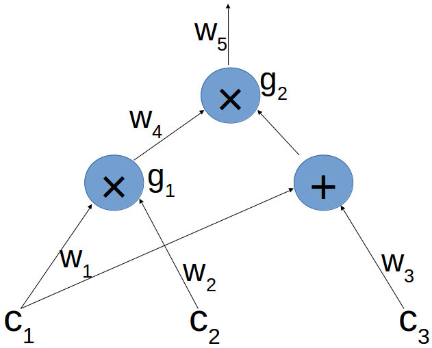

--- 
title: "Construct zk-SNARKS Step by Step"
author: |
  | lambda, ThunderDB
  | zeqing.guo@thunderdb.io
date: "March, 2018"
---

# Homomorphic Encryption

- **Definition:** Homomorphic encryption allows computation on ciphertext which, when decrypted, matches the operations as if they had performed on the plaintext
- An example - RSA: $\mathcal{E}(x_1) \cdot \mathcal{E}(x_2)=\mathcal{E}(x_1 \cdot x_2)$ , so we have $\mathcal{D}(\mathcal{E}(x_1) \cdot \mathcal{E}(x_2))=\mathcal{D}(\mathcal{E}(x_1 \cdot x_2)) =x_1 \cdot x_2$

# Blind Evaluation of Polynomials

- $\mathbb{F}_p$ denotes to a field of size p; that is, the elements of $\mathbb{F}_p$ are ${0, \cdots, p - 1}$ and addition and multiplication are done $mod p$
- $P(X)=a_0+a_1 \cdot X + a_2 \cdot X^2 + \cdots + a_d \cdot X^d$ for some $d, a_0, \cdots, a_d \in \mathbb{F}_p$ 
- We can evaluate $P$ at a point $s \in \mathbb{F}_p$: 
    - $P(s)=a_0+a_1 \cdot s + a_2 \cdot s^2 + \cdots + a_d \cdot s^d$ 
- Suppose Alice has a polynomial $P$ of degree $d$, and Bob has a point $s \in \mathbb{F}_p$. Bob wishes to learn $E(P(s))$ where $E$ is some encryption algorithm but Alice does want to sends $P$ to Bob, and Bob does want to send $s$ to Alice
- In the _bind evaluation problem_
    - Bob learns $E(P(s))$ without learning $P$ 
    - Alice does not learn $s$
- How to do this? Using homomorphic encryption: $E(ax+by)=g^{(ax+by)}=g^{ax}\cdot g^{by} = (g^x)^a \cdot (g^y)^b = E(x)^a \cdot E(y)^b$
    1. Bob sends to Alice the hidings $E(1), E(s), \cdots, E(s^d)$
    2. Alice computes $E(P(s))$ from the elements sent in the first step, and sends $E(P(s))$ to Bob

# The Knowledge of Coefficient Test and Assumption

Before we go deep into zk-SNARKS, we need to learn a basic tool

- Knowledge of coefficient test:
    1. Bob chooses random $\alpha \in \mathbb{F}^*_p$ and $a \in G$, where order $|G| = p$ and $a \neq 0$. He computes $b = \alpha \cdot a$
    2. He sends to Alice the "challenge" pair $(a, b)$. Note that $(a, b)$ is an $\alpha$-pair
    3. Alice must now response with a different pair $(a^\prime, b^\prime)$ that is also an $\alpha$-pair
    4. Bob accepts Alice's response only if $(a^\prime, b^\prime)$ is indeed an $\alpha$-pair (as he knows $\alpha$ he can check if $b^\prime = \alpha \cdot a^\prime$)
- Knowledge of coefficient assumption:
    1. Alice simply chooses some $\gamma \in \mathbb{F}^*_p$
    2. She computes $(a^\prime, b^\prime) = (\gamma \cdot a, \gamma \cdot b)$ and sends to Bob
    - In this case, we have: $b^\prime = \gamma \cdot b = \gamma \alpha \cdot a = \alpha (\gamma \cdot a) = \alpha \cdot a^\prime$

# Verifiability of Blind Evaluation of Polynomial

_Verifiability_: the probability that Alice sends a value not of the form $E(P(s))$ for $P$ of degree $d$ that is known to her, but Bob still accepts - is negligible 

Assume that our homomorphic encryption is the mapping $E(x) = x \cdot g$ for a generator $g$ of G as above. We present the protocol for verifiable blind evaluation

1. Bob chooses a random $\alpha \in \mathbb{F}^*_p$, and sends to Alice the hidings $g, s \cdot g, \cdots, s^d \cdot g$ (of $1, s, \cdots, s^d$) and also the hidings $\alpha \cdot g, \alpha s \cdot g, \cdots, \alpha s^d \cdot g$ 
2. Alice computes $a = P(s) \cdot g$ and $b = \alpha P(s) \cdot g$ using the elements sent in the first step, and sends both to Bob
3. Bob checks that $b = \alpha \cdot a$, and accepts if and only if this equality holds

# From Computations to Polynomials

Suppose Alice wants to prove Bob she knows $c_1, c_2, c_3 \in \mathbb{F}_p$ such that $(c_1 \cdot c_2) \cdot (c_1 + c_3) = 7$

{width=270px}

- Present the expression computed from $c_1, c_2, c_3$ as an *arithmetic circuit*:
    - When the same outgoing wire goes into more than one gate, we still think of it as one wire - like $w_1$ in the example
    - We assume multiplication gates have exactly two input wires, which we call the left wire and right wire
    - We don't label the wires going from an addition to multiplication gate, nor the addition gate; we think of the inputs of the addition gate as going directly into the multiplication gate. So in the example we think of $w_1$ and $w_3$ as both being right inputs of $g_2$
- A _legal assignment_ for the circuit, is an assignment of values to the labeled wires where the output value of each multiplication gate is indeed the product of the corresponding inputs
- So for our circuit, a legal assignment is of the form: $(c_1, \cdots, c_5)$ where $c_4 = c_1 \cdot c_2$ and $c_5 = c_4 \cdot (c_1 + c_3)$

# From Computations to Polynomials 

## Reduction to a QAP

- _Target points_: $g_1$ will be associated with $1 \in \mathbb{F}_p$ and $g_2$ with $2 \in \mathbb{F}_p$
- Left wire polynomials: $L_1, \cdots, L_5$, right wire polynomials: $R_1, \cdots, R_5$, and output wire polynomials: $O_1, \cdots, O_5$
- As $w_1, w_2, w_4$ are the left, right and output wire of $g_1$; we define $L_1 = R_2 = O_4 = 2 - X$, as the polynomial $2 - X$ is one on the point $1$ corresponding to $g_1$ and zero on the point $2$ corresponding to $g_2$
- With the same reason, $L_4=R_1=R_3=O_5=X - 1$
- We set the rest of the polynomials to be the zero polynomial
- Given fixed values $(c_1, \cdots, c_5)$ we use them as coefficient to define a left, right, and output "sum" polynomial:
    - $L := \Sigma^5_{i=1}, c_i \cdot L_i, R := \Sigma_{i=1}^5 c_i \cdot R_i, O := \Sigma_{i=1}^5 c_i \cdot O_i$
    - $P := L \cdot R - O$
    - Target polynomial $T(X) := (X-1) \cdot (X-2)$ and we have that $T$ divides $P$: $P(X) = T(X) \cdot H(X)$ 

# The Pinocchio Protocol

- A simple Pinocchio protocol
    1. Alice chooses polynomials $L, R, O, H$ of degree at most $d$
    2. Bob chooses a random point $s \in \mathbb{F}_p$, and computes $E(T(s))$.
    3. Alice sends Bob the hidings of all these polynomials evaluated at $s$, i.e. $E(L(s)), E(R(s)), E(O(s)), E(H(s))$
    4. Bob checks if the desired equation holds at $s$. That is, he checks whether $E(L(s) \cdot R(s) - O(s)) = E(T(s) \cdot H(s))$
- The complete Pinocchio protocol: hiding $E(L(s)), E(R(s)), E(O(s)), E(H(s))$
    - Alice will conceal her assignment in step 1 by adding a "random T-shift" $\theta_1, theta_2, theta_3 \in \mathbb{F}^*_p$ to each polynomial

So we have: $L_z:=L+\delta_1 \cdot T, R_z:=R+\delta_2\cdot T, O_z:=O+\delta_3\cdot T$

And

$$
\begin{align*}
L_z \cdot R_z - O_z & = (L + \delta_1 \cdot T)(R+\delta_2 \cdot T) - O - \delta_3 \cdot T\\
& = (L \cdot R - O) + L \cdot \delta_2 \cdot T + \delta_1 \cdot T \cdot R + \delta_1\delta_2\cdot T^2 - \delta_3 \cdot T \\
& = T \cdot (H + L \cdot \delta_2 + \delta_1 \cdot R + \delta_1 \delta_2 \cdot T - \delta_3)\\
& = T \cdot H_z
\end{align*}
$$

# Summary

1. Setup: a trusted party choose a random $\alpha \in \mathbb{F}_r^*, s \in \mathbb{F}_r$ and publish the _common reference string (CRS):_
    - $E(1), E(s), E(s^2), \cdots, E(s^d), E(\alpha), E(\alpha s), \cdots, E(\alpha s^d)$
    - $E(T(s)), E(\alpha T(s))$
    - $E(L_i(s)), E(\alpha L_i(s)), E(R_i(s)), E(\alpha R_i(s))$
    - $E(O_i(s)), E(\alpha O_i(s))$
2. Prover computes $h(s)$ and $(c_1, \cdots, c_d)$
3. Verifier verifies:
    - $(E(L(s)), \alpha) = (E(\alpha L(s)), 1)$
    - $(E(R(s)), \alpha) = (E(\alpha R(s)), 1)$
    - $(E(O(s)), \alpha) = (E(\alpha O(s)), 1)$
    - $(E(H(s)), \alpha) = (E(\alpha H(s)), 1)$
    - $E(L(s))E(R(s)) - E(O(s)) = E(T(s)) \cdot E(H(s))$
    
